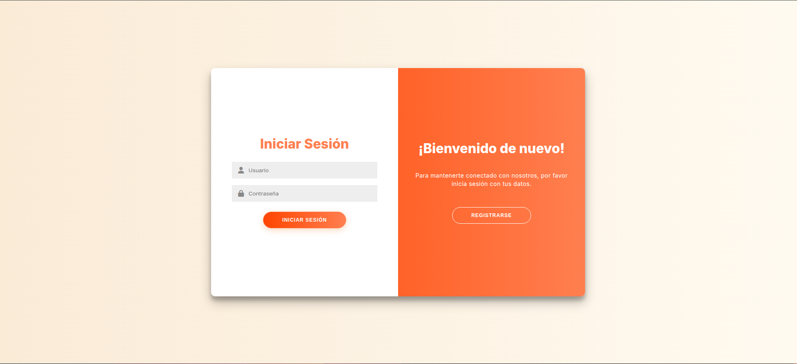
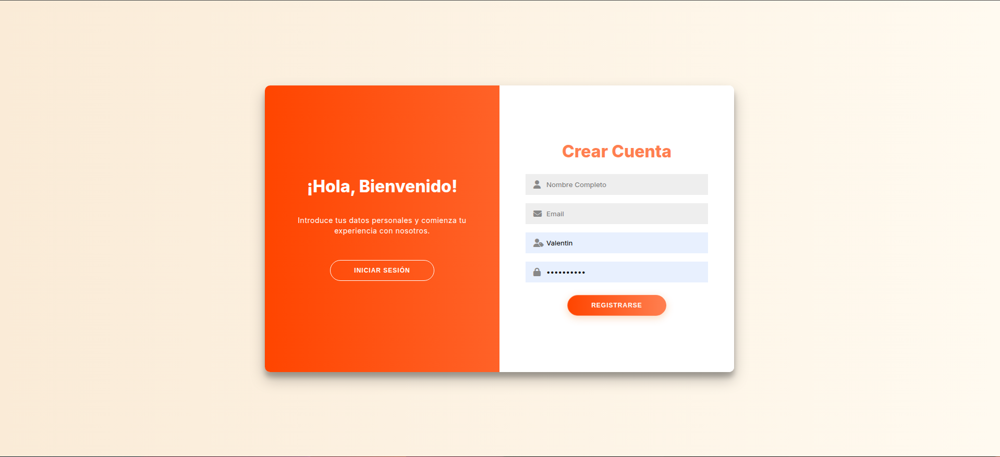
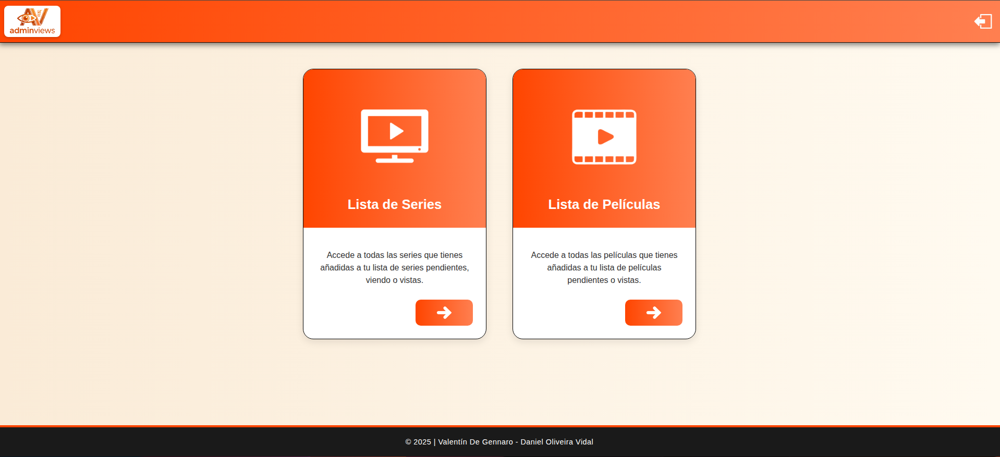
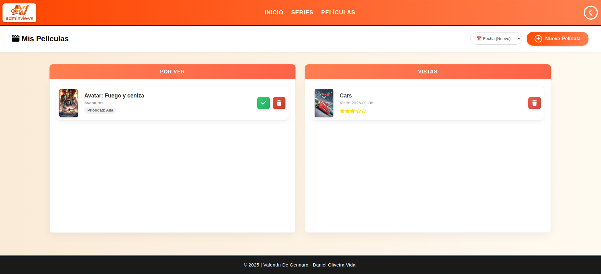
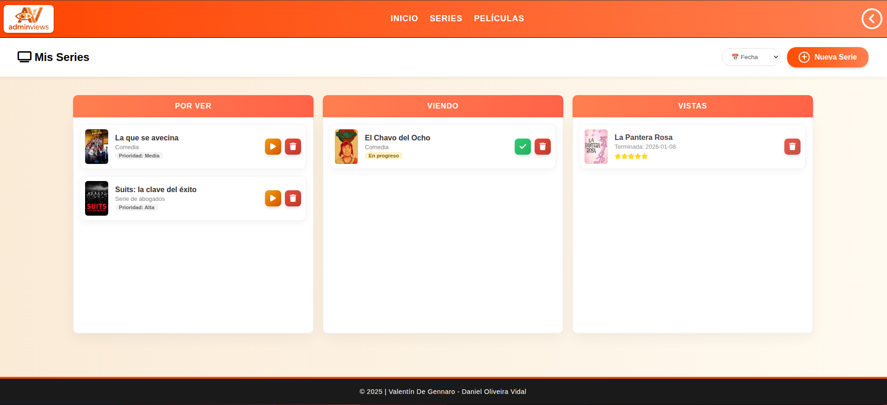

# 🎬 AdminViews - Tracker de Series y Películas

**AdminViews** es una aplicación web diseñada para llevar un control personal del contenido audiovisual que consumes. Permite a los usuarios registrarse y organizar series y películas en listas personalizadas según su estado (viendo, vistas, pendientes).

---

## 🔎 URL del proyecto: https://adminviews.valentindg.com/  

---
## 📂 Estructura del Proyecto

El proyecto se divide en Front-end (interfaz) y Back-end (lógica y datos).

### `/front` (La Aplicación Web)
Aquí reside todo el código fuente de la página web.
*   **`index.php`**: Página de aterrizaje. Contiene el **Login** y **Registro**.
*   **`exito.php`**: Panel principal (Dashboard). Es la primera pantalla que ves al iniciar sesión.
*   **`peliculas.php` / `series.php`**: Módulos principales para gestionar tu contenido.
*   **`/controladores`**: Scripts PHP que procesan formularios (Login y Registro) pero no muestran interfaz.
*   **`/inc`**: Fragmentos de código reutilizables (Conexión a BD, Cabeceras, Pie de página).
*   **`/css`** y **`/img`**: Estilos y recursos gráficos.

### `/back` (Base de Datos)
Archivos relacionados con la estructura de datos.
*   **`BD.sql`**: Script SQL para crear la base de datos y las tablas necesarias.
*   **Diagramas**: Imágenes o archivos que explican el modelo Entidad-Relación.

---

# 👁️ Vista previa

---

---

---

---

---

---

## 🧠 Lógica de la Aplicación

### 1. Autenticación (Login/Registro)
El sistema usa `session_start()` de PHP para mantener al usuario conectado.
*   **Registro**: Valida que el correo sea real, que la contraseña sea segura (+8 caracteres, mayúscula, símbolo) y encripta la contraseña con `password_hash()` antes de guardarla.
*   **Login**: Busca al usuario y compara la contraseña ingresada con el hash guardado usando `password_verify()`.

### 2. Gestión de Contenido
Cada vez que añades, borras o mueves una serie/película:
1.  **Frontend**: El formulario envía una petición POST con una `accion` (ej: "agregar", "mover").
2.  **Backend (Mismo archivo)**: PHP detecta el POST, ejecuta la consulta SQL correspondiente y recarga la página (`header("Location: ...")`) para mostrar los cambios actualizados.

### 3. API Externa
Para facilitar el llenado de datos, la app se conecta a la API de **TheMovieDB (TMDB)**. Al escribir el nombre de una película/serie, autocompleta el título y busca la portada oficial.

---

## 🛠️ Tecnologías Utilizadas

*   **Lenguaje:** PHP (Nativo, sin frameworks).
*   **Base de Datos:** MySQL
*   **Frontend:** HTML5, CSS3 (Diseño responsivo y animaciones), JavaScript.
*   **Externo:** API TheMovieDB (Fetch JS).

---

## ✒️ Autores

<a href="https://github.com/Valentindg2506" target="_blank">
  
  <b>Valentin De Gennaro</b>
</a>
<a href="https://github.com/ElOrange12" target="_blank">
   
  <b>Daniel Oliveira</b>
</a>
